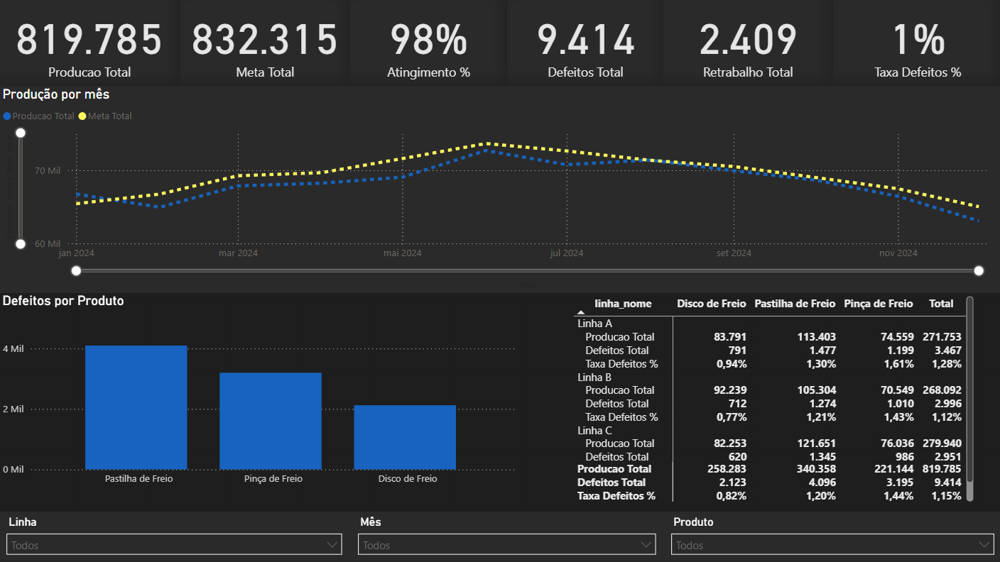

# Dashboard de KPIs Industrial

## Objetivo
Monitorar a performance de produção e qualidade de uma fábrica, com foco em atingir metas e reduzir defeitos.

## Contexto
- Setor: Manufatura
- Linhas de produção: Linha A, Linha B, Linha C
- Produtos: P1, P2, P3
- Periodicidade: Mensal

## Problemas para resolver
1) Estamos batendo a **meta de produção** por linha e produto?
2) Onde estão os **maiores problemas** (linha/produto)?
3) Qual é a **eficiência** (produção real ÷ planejada)?
4) O **retrabalho** está crescendo ou caindo?

## KPIs
- **Produção Real (qtd)**
- **Meta de Produção (qtd)**
- **Atingimento da Meta (%) = Produção / Meta**
- **Defeitos (qtd)**
- **Taxa de Defeitos (%) = Defeitos / Produção**
- **Retrabalho (qtd)**

## Dados Utilizados
- **Producao_Mensal**: ano_mes, linha, produto, producao_real, meta_producao
- **Qualidade_Mensal**: ano_mes, linha, produto, defeitos, retrabalho
- **Dim_Linha**: linha, descrição
- **Dim_Produto**: produto, descrição, família

## Ferramentas
- Excel para pré-tratamento de dados
- Power BI para modelo
- GitHub para versão e documentação

## O que estou aprendendo
1) Estou criando a estrutura do projeto
2) Importar os arquivos pelo powerbi e tratar pelo powerquery
3) Criar os relacionamentos entre tabelas pelo powerbi
4) Adicionar novas medidas
5) Criar o Layout do Dashboard
6) Editar as cores utilizando funções DAX
7) Gerar Insights a partir dos Dashboards

## Visão geral do Dashboard

## Principais Insights

- A produção ficou **1,51% abaixo da meta** do ano, representando **12.530 peças a menos** que o planejado para o período
- O produto com maior impacto negativo foi a **Pastilha de Freio**
- A **Linha C** teve a maior produção total
- Entre maio e agosto houve um pico de desempenho, seguido de queda no último trimestre

## Respostas às Perguntas de Negócio
1) Estamos batendo a **meta de produção** por linha e produto?
- Não. No total anual ficamos abaixo da meta (-12.530 peças)
2) Onde estão os **maiores problemas** (linha/produto)?
- Pastilha de Freio concentrou 42% dos defeitos, principalmente na Linha C
3) Qual é a **eficiência** (produção real ÷ planejada)?
- Eficiência anual: 98,5%.
4) O **retrabalho** está crescendo ou caindo?
Retrabalho apresentou leve crescimento no final do ano